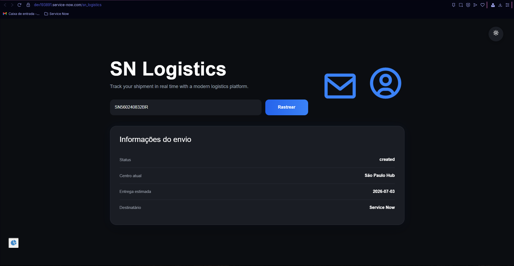
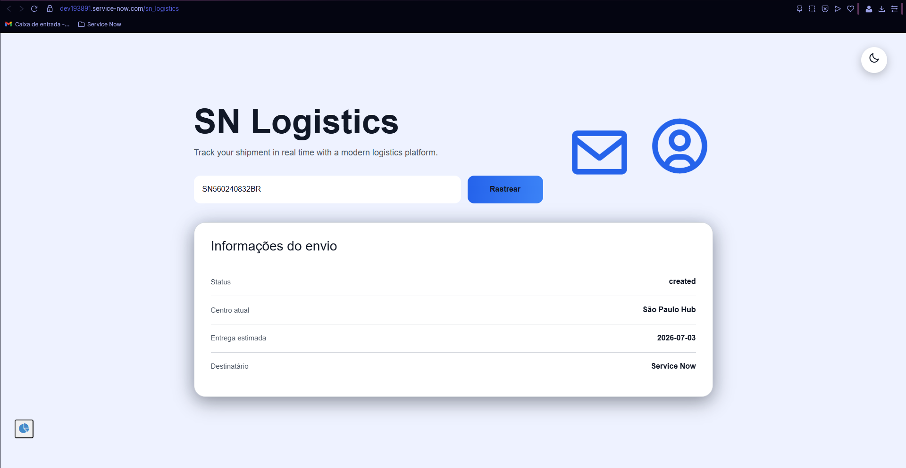
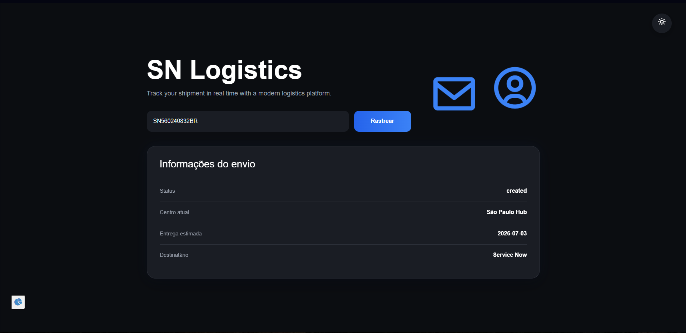
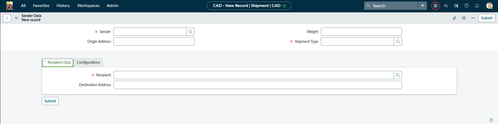
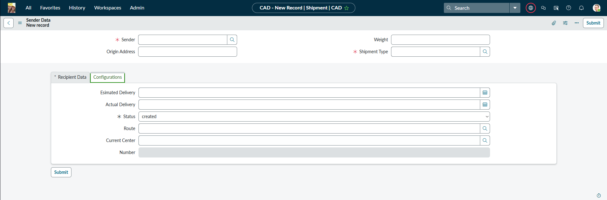
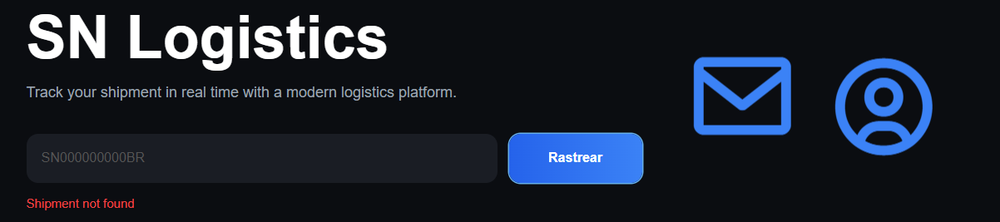
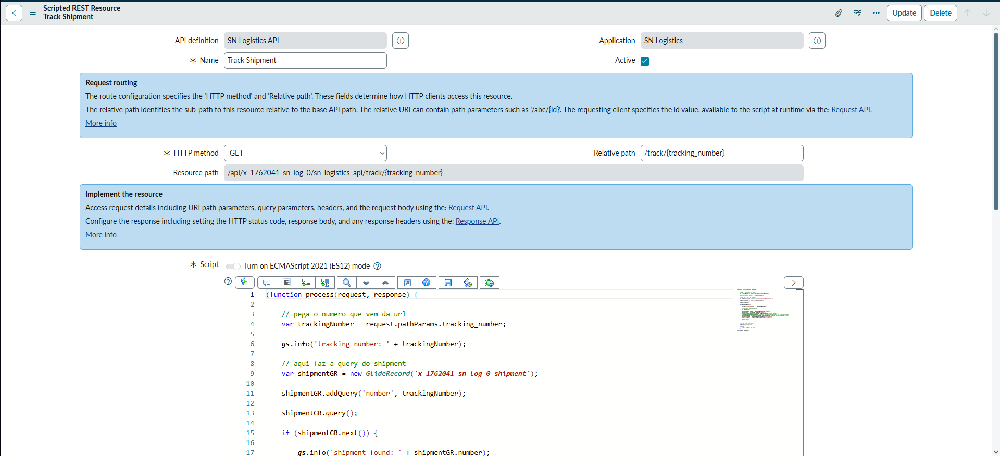
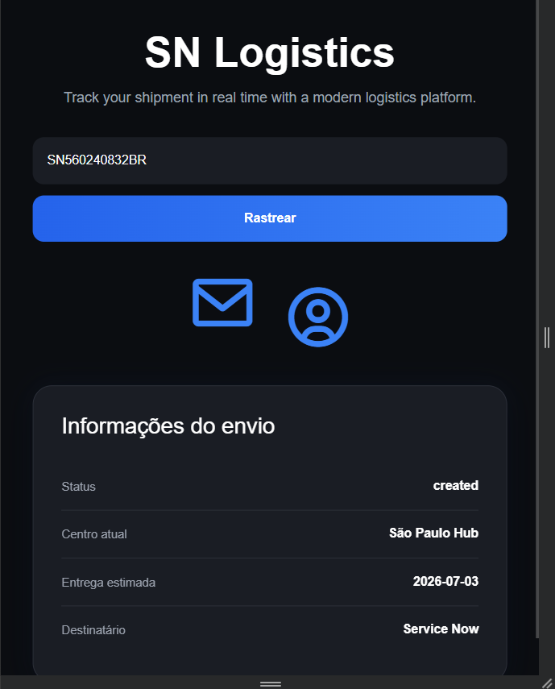

# SN Logistics ✉️

> Track your shipment in real time with a modern logistics platform.



---

# Sobre o projeto

Esse projeto começou em março de 2026 quando eu comecei a estudar pro CAD (Certified Application Developer) da ServiceNow.

No começo a ideia era só fazer alguma coisa simples pra praticar GlideRecord, Business Rule e REST API.

Aí eu tive a brilhante ideia de

```text
"e se eu fizer um app inteiro de logística, tipo o dos correios ?"
```
😭

O problema é que eu ainda tava aprendendo metade das coisas.

Então esse projeto virou basicamente
- tutorial
- documentação da ServiceNow (MUITA)
- debug (MUITOS)
- sofrimento (DEMAIS)
- café (dente ficou até amarelo)
- mais debug 
- eu quebrando coisa que já funcionava

Masssssss,
Sem dúvidas foi uma das coisas que mais me fizeram aprender ServiceNow de verdade.

---

# O que é o SN Logistics?

O SN Logistics é um portal de rastreamento de envios feito dentro da ServiceNow.

Você coloca um código de rastreio e o sistema
- busca o shipment
- chama uma Scripted REST API
- retorna os dados
- mostra tudo em uma interface customizada

Tudo isso usando
- Service Portal
- Widget customizado
- AngularJS
- GlideRecord
- Business Rules
- Scheduled Jobs
- Scripted REST API

---

# Features

✅ Rastreamento de encomendas  
✅ Dark mode / Light mode  
✅ Interface responsiva  
✅ API REST customizada  
✅ Atualização automática de status  
✅ Tracking events automáticos  
✅ Geração automática de código de rastreio  
✅ Route system  
✅ Simulação de entregas  
✅ Sistema de delays  
✅ UI totalmente customizada  
✅ Workflow para notifação

---

# O portal

A UI foi feita inteira no widget do Service Portal.

Eu não queria fazer um portal todo branco com cara padrão de ServiceNow (mal sabia eu que isso ia dar um trabalho ** 2)

Então tentei fazer algo mais moderno
- glassmorphism
- keyframe (os icones azul se mexem)
- dark mode
- gradients
- hover
- floating icons
- layout mais clean





---

# Como funciona

## 1. Shipment

O shipment guarda
- remetente
- destinatário
- rota
- centro atual
- status
- tempo estimado da entrega
- tipo de envio



---

## 2. Tracking Number

Quando um shipment é criado
- uma Business Rule gera automaticamente um tracking number

Exemplo

```text
SN560240832BR
```

---

## 3. Rastreamento

O usuário digita o código



O widget chama essa API

```text
/api/x_1762041_sn_log_0/sn_logistics_api/track/{tracking_number}
```

A API faz uma query usando GlideRecord e retorna
- status
- current center
- recipient
- estimated delivery
- tracking number

---

# Scripted REST API

Essa foi provavelmente uma das partes que mais me fizeram aprender.

Eu apanhei MUITO pra entender
- request
- response
- path params
- JSON
- retorno da API
- debug



---

# O bug mais absurdo do projeto

Eu fiquei QUASE 2 HORAS tentando entender porque o estimated delivery NÃO aparecia no portal.

Eu revisei
- widget
- Angular
- API
- Business Rule
- GlideRecord
- response
- JSON
- tudo

Pra no final descobrir que o campo tava escrito

```text
Esimated Delivery
```

SEM O "T".

😭😭😭😭😭😭😭😭😭

E como eu arrumei ? Atualizei tudo que chamava o estimated delivery por esimated delivery, não troquei o nome não KKKKKKKKKKKKK são as cicatrizes do debug


---

# Scheduled Job

Também criei um scheduler que
- atualiza status
- move shipments
- marca como delayed
- entrega automaticamente


parece um sistema vivo, que atualizava em tempo real mesmo.

---

# Business Rules

Tem várias BRs no projeto
- Generate Tracking Number
- Create Initial Tracking
- Create Tracking Event
- Validate Status Transition
- Status Auto
- Update Current Center

algumas estão meio quebradas.
Mas funcionam 😭

---

# Dark Mode

O dark mode foi feito usando troca de classes no widget

```javascript
pagina.classList.toggle('light');
pagina.classList.toggle('dark');
```

Simples.
Sem framework absurdo.
Sem complicação.

E honestamente?
Foi uma das partes que mais gostei do resultado final.


vamos ignorar que o toggle está desalinhado ok

---

# Responsividade

Também tentei deixar o portal minimamente responsivo.

Então ele funciona relativamente bem no
-classic
-mobile



---

# Tecnologias usadas

- ServiceNow
- Service Portal
- AngularJS
- JavaScript
- GlideRecord
- Scripted REST API
- Business Rules
- Scheduled Jobs
- HTML
- CSS
- Boxicons

---

# O que eu aprendi

Esse projeto me ensinou MUITO sobre
- arquitetura dentro da ServiceNow
- como APIs funcionam
- debugging
- portal
- widget
- GlideRecord
- fluxo de dados
- estrutura de aplicações

Mas principalmente
como resolver problema


---

# Observações importantes

Esse projeto NÃO é perfeito.

E sendo sincero, nem era essa a ideia.

Eu queria fazer algo
- funcional
- bonito
- divertido
- e que parecesse um projeto real

E isso eu consegui 

---

# Próximos passos

Coisas que ainda quero adicionar
- tracking timeline
- autenticação
- dashboard admin
- mapa de rotas
- histórico completo de tracking

---

# Projeto desenvolvido por

Isaac Ambrozevicius 

CSA Certified System Administrator - ServiceNow
CAD Certified Application Developer — ServiceNow

---